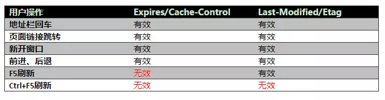

# web缓存那点事
**web缓存**基本上就分为两个部分，前端缓存和后端缓存。

##前端缓存

前端缓存的工作是浏览器在工作。浏览器缓存又可以分为基于HTTP的缓存和非基于HTTP的缓存。
非基于HTTP的缓存比较简单，便是html5的mainfest。还有是在<head>节点中加入<meta>标签
```<meta http-equiv="Pragma" content="no-cache">```
该方法只有部分浏览器支持，而且所有缓存代理服务器都不支持，因为代理不解析HTML内容。

基于HTTP的缓存则是在HTTP请求的头部字段中加以控制。比如HTTP1.0中的Expires和HTTP1.1中Cache-Control。Expires和Cache-Control就是服务端用来约定和客户端的有效时间的。Expires规定了缓存失效时间（Date为当前时间），而Cache-Control的max-age规定了缓存有效时间（2552s）。
Cache-Control的参数有很多，其值可以选取为`no-cache`,`no-store`和`must-revalidate`等。

`no-cache`和`no-store`这两个从字面上来看意思好像差不多，其实不然。在MDN上的定义是这样的：
> **no-cache**
Forces caches to submit the request to the origin server for validation before releasing a cached copy.

`no-store`就如字面意思那样不对任何页面进行储存。
除此之外请求报头在还包含了另一些相关的字段，这些字段用来确认当前的缓存是否过期。这些字段分别是
*`If-Modified-Since`
*`Last-Modified`
*`ETag`
*`If-None-Match`

`If-Modified-Since`和`Last-Modified`，请求报头中带上该字段和服务器上相对应文件或者page的mtime比较，没发生改变服务器返回304。`ETag`和`if-none-match`是在Http1.1中被提出，作用和前面提到的类似。不同的是`ETag`是一个文件或者page的唯一标识，请求报头中`If-None-Match`带着上次服务器返回的`ETag`值到服务器端。这里推荐使用的是`If-None-Match`，其原因为
* `If-Modified-Since`只精确到秒级，如果在1秒内发生变动是无法被检测到。
* 如果某些文件会被定期生成，但有时内容并没有任何变化（仅仅改变了时间），但Last-Modified却改变了，导致文件没法使用缓存。
* 有可能存在服务器没有准确获取文件修改时间，或者与代理服务器时间不一致等情形。

`If-None-Match`中有一个特殊的值："*"。MDN中特别提到这一点
>For other methods, and in particular for PUT, If-None-Match used with the * value can be used to save a file not known to exist, guaranteeing that another upload didn't happen before, losing the data of the previous put; this problems is the variation of the lost update problem.

在RFC中又是这样解释的
>if "*" is given and any current entity exists for that resource, then the server MUST NOT perform the requested method, unless required to do so because the resource's modification date fails to match that supplied in an If-Modified-Since header field in the request.
>The meaning of "If-None-Match: *" is that the method MUST NOT be performed if the representation selected by the origin server (or by a cache, possibly using the Vary mechanism, see section 14.44) exists, and SHOULD be performed if the representation does not exist. This feature is intended to be useful in preventing races between PUT operations.

还有一个方面和用户的行为有关系



##后端缓存

后端缓存主要也分两大类，在数据库缓存和在服务器上缓存。


**数据库缓存**，如果是关系型数据库，可以对表建立高速缓存，也可以建立存储过程。还可以利用非关系型数据库作为缓存层，比如redis、memcached这些高效的基于内存非关系型数据库，读取非常快。

**服务器缓存**

*代理服务器缓存*
代理服务器是浏览器和源服务器之间的中间服务器，浏览器先向这个中间服务器发起Web请求，经过处理后（比如权限验证，缓存匹配等），再将请求转发到源服务器。代理服务器缓存的运作原理跟浏览器的运作原理差不多，只是规模更大。可以把它理解为一个共享缓存，不只为一个用户服务，一般为大量用户提供服务，因此在减少相应时间和带宽使用方面很有效，同一个副本会被重用多次.

*CDN缓存*
CDN（Content delivery networks）缓存，也叫网关缓存、反向代理缓存。CDN缓存一般是由网站管理员自己部署，为了让他们的网站更容易扩展并获得更好的性能。浏览器先向CDN网关发起Web请求，网关服务器后面对应着一台或多台负载均衡源服务器，会根据它们的负载请求，动态将请求转发到合适的源服务器上。虽然这种架构负载均衡源服务器之间的缓存没法共享，但却拥有更好的处扩展性。从浏览器角度来看，整个CDN就是一个源服务器，从这个层面来说，本文讨论浏览器和服务器之间的缓存机制，在这种架构下同样适用。

反向代理

